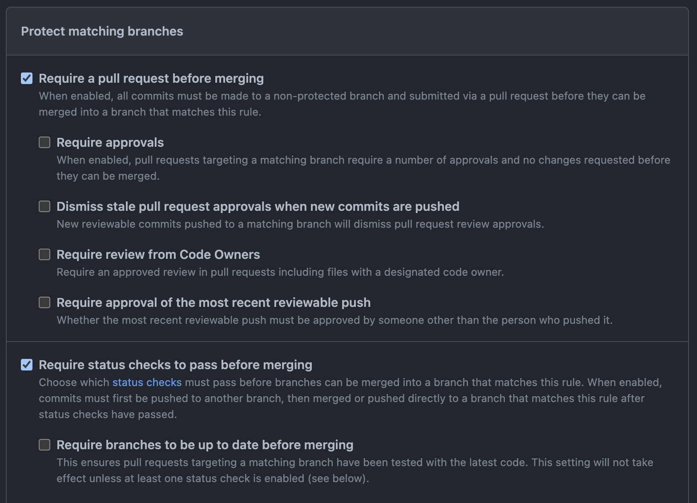

# Branch Enforcement Action


This action lets you enforce a merge policy between branches in your repository.
This action lets you specify branch names or glob patterns to compare the `base`
and `head` refs of a pull request. If an incoming pull request does not match at
least one of the specified patterns, the action will fail.

For example, if you want to enforce a policy where developers can merge their
feature branches into `dev`, but only the `dev` branch can be merged into `qa`,
and only `qa` into `main`, you can use this action with the following policy:

```yaml
policy: |
  *:dev
  dev:qa
  qa:main
```

Using this policy, and the appropriate branch protection rules, if you create a
new branch and try to merge it into any branch besides `dev`, the pull request
will not pass the required status check.

## Supported Patterns

> [!NOTE]
>
> Because of the security implications of allowing arbitrary regular
> expressions, this action only supports a subset of glob-like patterns. The
> following table describes those patterns:

| Pattern         | Example      | Definition                           |
| --------------- | ------------ | ------------------------------------ |
| `*`             | `*`          | Any branch                           |
|                 |              | Doesn't match slashes (`/`)          |
| `**/*`          | `**/*`       | Any branch                           |
|                 |              | Matches slashes (`/`)                |
| `<string>/*`    | `users/*`    | Any branch starting with `<string>/` |
|                 |              | Doesn't match multiple slashes (`/`) |
| `<string>/**/*` | `users/**/*` | Any branch starting with `<string>/` |
|                 |              | Matches multiple slashes (`/`)       |

## Usage

To use this action and enforce your merging policy, you will need to do the
following:

### Step 1: Configure Branch Protection

Create a
[branch protection rule](https://docs.github.com/en/repositories/configuring-branches-and-merges-in-your-repository/managing-protected-branches/about-protected-branches)
for each branch you want to restrict. At minimum, the rule must enforce the
following:

- Require a pull request before merging
- Require status checks to pass before merging (the workflow that calls this
  action must be included in the list of required checks)



### Step 2: Create a Workflow File

Create a new workflow file in your repository. You can do this by creating a new
file in the `.github/workflows` directory. Your workflow must specify the
following:

| Key                | Description                                            |
| ------------------ | ------------------------------------------------------ |
| `on: pull_request` | Trigger the workflow when a PR is opened / updated     |
|                    | Sets `github.head_ref` / `github.base_ref` variables   |
| `permissions`      | The workflow must have `write` permissions to statuses |
|                    | This is required to set the status of the pull request |

For example, you can create a file called `branch-enforcement.yml` with the
following contents.

> [!NOTE]
>
> The policy should be specified as a YAML string, with each entry on a separate
> line. The format of each entry is `<base>:<head>`, where `<base>` and `<head>`
> are glob-like patterns.

```yaml
name: Branch Enforcement

on:
  pull_request:

jobs:
  check-branch:
    name: Check Branches
    runs-on: ubuntu-latest

    permissions:
      statuses: write

    env:
      # The branch being merged.
      HEAD_REF: ${{ github.head_ref }}
      # The target branch.
      BASE_REF: ${{ github.base_ref }}

    steps:
      # Policy:
      #   - Any branch can be merged into dev (e.g. feature branches)
      #   - dev can be merged into qa
      #   - qa can be merged into main
      - name: Enforce Merge Policy
        id: enforce-policy
        uses: ncalteen/branch-enforcement@v2
        with:
          policy: |
            *:dev
            dev:qa
            qa:main
          head_ref: ${{ env.HEAD_REF }}
          base_ref: ${{ env.BASE_REF }}

      # This step should not run if the branch policy is not met.
      - name: Policy Passed
        id: passed
        run: echo "This PR passes the merge policy!"
```
